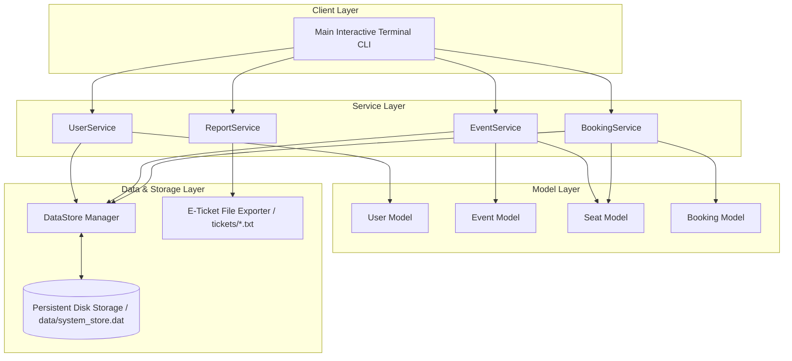
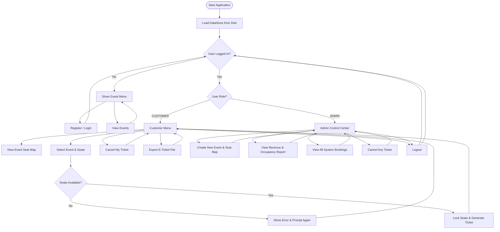
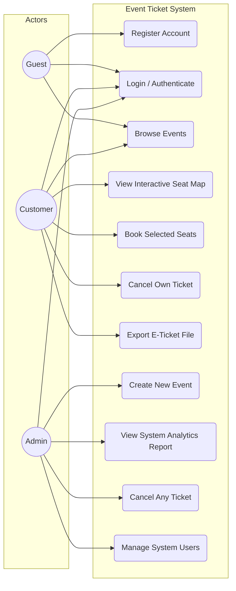
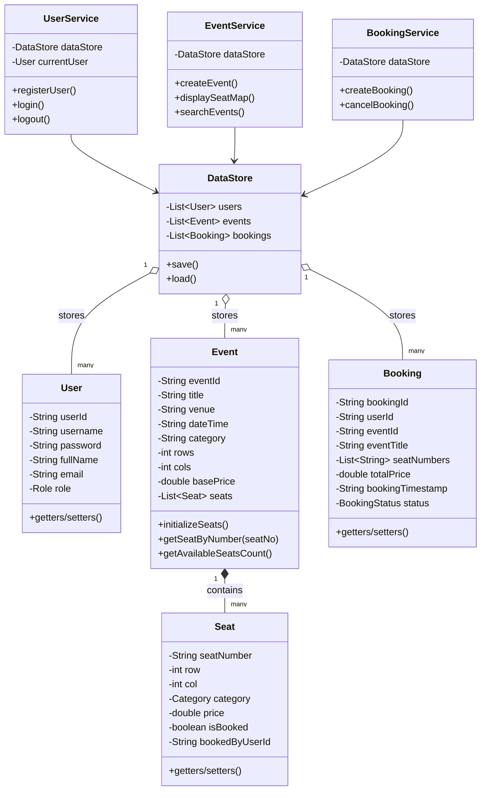
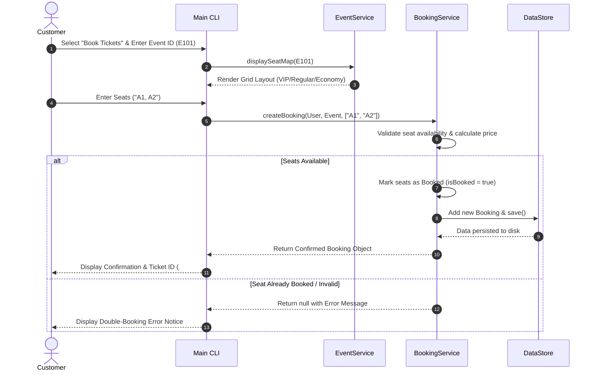

# Event Ticket & Seat Management System - Technical Design Document

## 1. Problem Statement
In educational, corporate, and entertainment domains, organizing events and managing seating arrangements manually or via fragmented spreadsheet tools leads to significant inefficiencies. Key challenges include:
- **Double-booking conflicts**: Simultaneous attempts to reserve identical seats.
- **Lack of transparency**: Inability for attendees to view real-time seat maps (VIP vs Regular vs Economy).
- **Opaque revenue reporting**: Difficulty tracking ticket sales, seat occupancy rates, and cancellation refunds.
- **System inefficiency**: Bloated web applications for simple CLI environments.

The **Event Ticket & Seat Management System** addresses these issues by providing a lightweight, robust Java terminal-based application that manages users, interactive seating layouts, ticket reservations, double-booking prevention, cancellations, and executive reporting.

---

## 2. Project Objectives
1. **Identify & Solve Real-World Problems**: Eliminate double-bookings and provide clear seat grid visualizations in CLI environments.
2. **Modular Technical Solution**: Apply Object-Oriented Programming (OOP) principles (Encapsulation, Inheritance, Abstraction, Polymorphism) and design patterns.
3. **Multi-Role User Management**: Provide secure access control for Admin and Customer roles.
4. **Data Persistence & Reliability**: Save system state locally across restarts without external database dependencies.
5. **Quality Assurance**: Implement comprehensive error validation and automated unit testing.

---

## 3. Requirements Specification

### 3.1 Functional Requirements
The system is divided into three core functional modules:

1. **User Management Module**:
   - User registration (Customer/Admin roles).
   - Authentication (Username & password verification).
   - Session tracking & role-based menu navigation.

2. **Event & Seat Management Module**:
   - Admin creation of events (Title, Venue, Date, Category, Custom Grid Rows x Cols, Base Price).
   - Automated seat map generation with tiered categories (VIP 150%, Regular 100%, Economy 85%).
   - Interactive CLI visualization of seat maps showing real-time seat availability (`[V A1]`, `[X BOOK]`).

3. **Booking & Analytics Module**:
   - Multi-seat selection and real-time transaction processing.
   - Atomic double-booking prevention and seat locking.
   - Ticket cancellation and automatic seat release with refund calculation.
   - System analytics: gross revenue, total active/cancelled tickets, seat occupancy rates.
   - Digital E-Ticket export to formatted text file (`tickets/Ticket_<ID>.txt`).

### 3.2 Non-Functional Requirements
1. **Performance**: Transaction response time under 100ms for seat reservation and layout rendering.
2. **Security**: Role-Based Access Control (RBAC) preventing normal users from accessing admin controls or modifying other users' tickets.
3. **Reliability & Data Integrity**: Synchronized booking methods preventing race conditions during concurrent seat requests; persistent disk storage (`data/system_store.dat`).
4. **Usability**: Clean ASCII terminal interface, formatted tables, and clear visual seat layout keys.
5. **Maintainability**: Clear separation of concerns into `model`, `service`, `util`, and `test` packages.
6. **Error Handling Strategy**: Graceful handling of invalid inputs (wrong formats, non-existent seats, duplicate usernames) with user-friendly warnings rather than application crashes.

---

## 4. System Architecture Diagram

---

## 5. Process Flow Diagram

---

## 6. UML Diagrams

### 6.1 Use Case Diagram

---

### 6.2 Class Diagram

---

### 6.3 Sequence Diagram: Seat Reservation & Ticket Generation

---

## 7. Storage Schema & Data Design

The application uses serialized object storage (`data/system_store.dat`) managed by `DataStore.java`, supplemented by exported text documents (`tickets/Ticket_<ID>.txt`).

### Data Entities & Schema

1. **User Entity**:
   - `userId`: String (Primary Key, e.g. "U101")
   - `username`: String (Unique)
   - `password`: String
   - `fullName`: String
   - `email`: String
   - `role`: Enum (`ADMIN`, `CUSTOMER`)

2. **Event Entity**:
   - `eventId`: String (Primary Key, e.g. "E101")
   - `title`: String
   - `venue`: String
   - `dateTime`: String
   - `category`: String
   - `rows`: Integer
   - `cols`: Integer
   - `basePrice`: Double
   - `seats`: List<Seat> (Nested 1-to-N relationship)

3. **Seat Entity (Nested within Event)**:
   - `seatNumber`: String (Composite Key within event, e.g. "A1")
   - `row`: Integer, `col`: Integer
   - `category`: Enum (`VIP`, `REGULAR`, `ECONOMY`)
   - `price`: Double
   - `isBooked`: Boolean
   - `bookedByUserId`: String (Foreign Key to User)

4. **Booking Entity**:
   - `bookingId`: String (Primary Key, e.g. "TKT10001")
   - `userId`: String (Foreign Key to User)
   - `eventId`: String (Foreign Key to Event)
   - `seatNumbers`: List<String>
   - `totalPrice`: Double
   - `bookingTimestamp`: String
   - `status`: Enum (`CONFIRMED`, `CANCELLED`)
